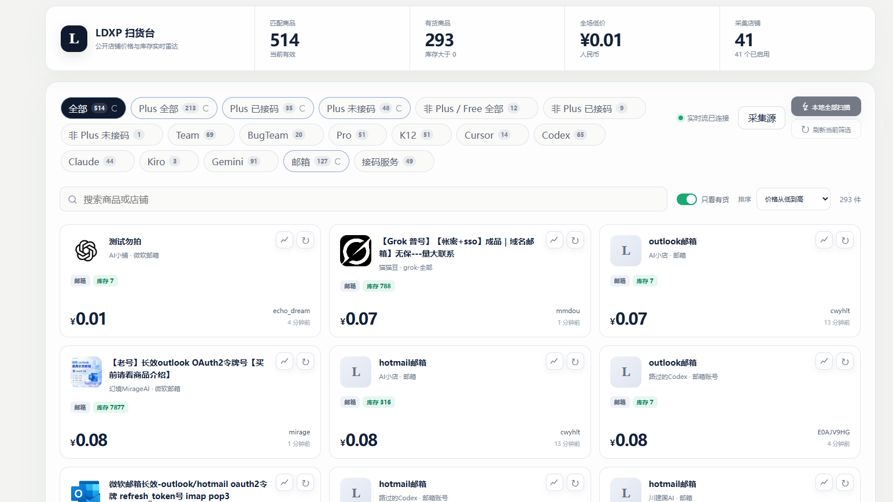

# LDXP 扫货台

面向公开店铺的商品比价与库存观察工具。服务端按计划采集公开商品信息，网页通过流式更新展示价格、分类、库存和评价聚合结果。

> 仅供学习和公开数据整理使用。请遵守目标站点条款、控制访问频率，并自行承担部署和使用责任。

## 特化版说明

本分支是面向 GPT 账号库存观察场景的特化版本，核心行为如下：

- 公开目录仅展示 `Plus 已接码`、`Team`、`BugTeam` 和 `K12`。其他分类继续保存在数据库中，但不展示、不搜索，也不进入主动刷新和浏览器校验队列。
- 分类标签同时显示在售总量、有货量和已下架量，并使用中性、绿色和红色状态色区分。
- 有货商品按最近变化时间动态升降级：低库存或 30 分钟内变化为 3 分钟，12 小时内变化为 5 分钟，24 小时内变化为 10 分钟，长期稳定为 15 分钟。
- 短期缺货商品每小时复查；长期缺货进入每日低频队列。服务器固有来源扫描保留来源间隔，手动赞助刷新不额外等待。
- 分类刷新按本机 IP 50 个、服务器 IP 50 个交替执行，同一轮次共享去重记录。`Plus 已接码` 和 `K12` 的分类刷新只处理有货商品，`Team` 和 `BugTeam` 处理全部在售商品。
- 控制台保留采集源、错误来源重试、赞助刷新商品和倍率，并提供当前分类缺货、下架商品的独立刷新入口。
- 商品支持按最近变化正序或反向排序；Nginx 上游短暂重启时返回自动重试的维护页，降低部署期间缓存失败页面的概率。

该分支不包含生产服务器地址、管理员凭据、数据库文件、代理订阅或本地聊天软件资源路径。

## 界面预览



## 已实现功能

- 聚合商品名称、公开购买链接、价格、市场参考价、分类和库存状态。
- 支持 Plus、Team、BugTeam、Codex、Claude、Gemini、Cursor、Kiro、邮箱、接码和中转站等分类。
- 中转站分类使用独立规则，排除邮箱/OAuth、短信接口、账号、教程脚本、订阅，以及仅在描述中提到中转用途的账号商品。
- 支持按关键词、分类、价格、库存、更新时间和评分筛选排序。
- 保存价格与库存历史节点，可按小时、天、周查看走势。
- 商品评论支持聚合评分；公开数据只输出评论数量和聚合分，不输出评论者身份、正文或图片。
- 已下架商品不进入常规扫描。新缺货商品约每 2 小时复查，连续缺货满 24 小时后进入每日一次的极懒更新。
- 每个来源记录最近扫描时间，调度时跳过已完成或仍在租约中的来源，减少重复请求。

## 浏览器刷新工厂

网页可领取 `24 × 倍率` 个刷新任务，倍率范围为 1 到 5，单次最多 120 个：

- 优先领取服务器当前待执行队列，没有待执行任务时再领取日常到期任务。
- 任务按来源逐个执行，按钮旁实时显示完成数、失败数和当前状态。
- 浏览器和服务器共享来源级租约，避免同时执行同一来源。
- 租约默认 10 分钟；浏览器未及时回传时，任务自动归还服务器继续处理。
- 请勿频繁领取，避免触发目标平台访问限制。

服务器全量更新按钮目前暂时停用；单商品刷新、浏览器任务领取和后台计划任务不受影响。

## 公开数据快照

仓库包含由服务器数据库生成的脱敏快照：

- `docs/data/catalog-summary.json`：商品数量、库存和分类汇总。
- `docs/data/catalog-snapshot.jsonl.gz`：每行一个 JSON 商品记录的 gzip 文件。

商品记录包含名称、公开购买链接、分类、价格、库存、最后更新时间、评论数、实际平均分和加权分。快照不包含服务器地址、登录凭据、内部来源令牌、评论者身份、评论正文或评论图片。

重新导出：

```powershell
python .\tools\export_public_catalog_snapshot.py .\data\ldxp.db .\docs\data
```

## 本地运行

项目只使用 Python 标准库：

```powershell
$env:LDXP_SCAN_INTERVAL = "900"
python .\app.py
```

打开 `http://127.0.0.1:8765/`。管理接口必须携带 `LDXP_ADMIN_KEY`；没有配置密钥时会拒绝管理操作。

常用环境变量见 [.env.example](.env.example)，包括监听地址、数据库路径、扫描间隔、请求超时和可选备用代理。不要把生产环境的域名、IP、密钥、数据库或代理订阅提交到仓库。

## Ubuntu 部署

全新 Ubuntu/Debian 主机可使用部署脚本：

```bash
curl -fsSL https://raw.githubusercontent.com/<account>/<repository>/main/deploy/bootstrap.sh | \
  sudo env LDXP_REPOSITORY=https://github.com/<account>/<repository>.git bash
```

安装脚本默认只监听 `127.0.0.1:8765`。如需接入已有 Nginx，显式传入站点配置路径和公开地址：

```bash
sudo env \
  LDXP_NGINX_SITE=/etc/nginx/sites-available/example.com \
  LDXP_PUBLIC_URL=https://example.com/ldxp/ \
  bash deploy/install.sh
```

## 后台扫描命令

```bash
sudo ldxp-scanctl status
sudo ldxp-scanctl enable 15
sudo ldxp-scanctl disable
sudo ldxp-scanctl interval 30
sudo ldxp-scanctl scan
sudo ldxp-scanctl discover
```

## 测试

```powershell
python -m unittest discover -s tests -v
node --check static/app.js
```

## 数据来源与边界

程序只处理公开页面和公开接口中的商品信息。公开首页通常不提供完整店铺目录，因此无法证明已覆盖所有私有或未公开来源。部署者应确认数据源条款、访问频率和当地法律要求。

## 许可证

[MIT License](LICENSE)
